# Data Story AI: From Static Reports to Dynamic Conversations

**🚀 [Try the live app](https://data-story-ai.streamlit.app)**

## Why Data Stories Matter

Business decisions need **context**, not just charts. The current state of business intelligence creates a fundamental gap between data and action:

```mermaid
graph LR
    A[Raw Data] --> B[Charts & Tables]
    B --> C[❓ So What?]
    C --> D[Manual Analysis]
    D --> E[Delayed Decisions]
```

Raw data doesn't tell you _why_ revenue dropped or _what_ to do about customer churn.

This is where **Data stories can help transform numbers into actionable narratives** that drive decisions.

## What Are Data Stories

Data stories are the bridge between raw information and business action. They combine three essential elements:

```mermaid
graph TD
    A[Data Story] --> B[📊 Data<br/>The Facts]
    A --> C[📖 Narrative<br/>The Context]
    A --> D[📈 Visuals<br/>The Clarity]

    B --> E[Revenue = $2M]
    C --> E[40% growth from mobile]
    D --> E[Trend charts & breakdown]

    E --> F[💡 Actionable Insight:<br/>Prioritize mobile experience]
```

Instead of showing "Sales = $2M," a data story explains "Sales hit $2M driven by 40% growth in mobile purchases, suggesting we should prioritize our mobile experience."

## Introducing "Data Story AI" Tool

Here's the challenge: Data stories are incredibly powerful, but traditionally they require skilled analysts to manually create them. This creates bottlenecks - you need technical expertise, time for analysis, and constant back-and-forth between business stakeholders and data teams.

**Data Story AI changes this.** I've built an AI-powered tool that automatically generates complete data stories from plain English questions. No SQL knowledge required. No waiting for analysts. Just ask your business question and get instant, comprehensive insights.

The AI agent handles the entire process: understanding your question, generating the right SQL queries, analyzing the results, and crafting a complete business narrative with visualizations and actionable recommendations.

## How Data Story AI Solves Traditional BI Problems

Traditional business intelligence creates bottlenecks that Data Story AI eliminates:

```mermaid
graph TD

    subgraph "✅ Data Story AI Process"
        A2[Business Question] --> B2[AI Agent]
        B2 --> C2[Instant SQL Generation]
        C2 --> D2[Real-time Analysis]
        D2 --> E2[Data Story Driven Insights]

        style A2 fill:#e8f5e8
    end
    subgraph "❌ Traditional BI Process"
        A1[Business Question] --> B1[Wait for Analyst]
        B1 --> C1[Manual SQL Queries]
        C1 --> D1[Static Analysis]
        D1 --> E1[Poor Insights]

        style A1 fill:#ffebee
    end
```

**The transformation**: From weeks to seconds, from static reports to dynamic conversations, from technical barriers to plain English interactions.

## Data Story AI Live Demo

**To see Data Story AI in action, visit the live demo app:**

**🎯 [Launch Data Story AI](https://data-story-ai.streamlit.app)** - No setup required

**Sample questions to try:**

- "What are our top revenue-generating product categories?"
- "Show me seasonal trends in customer purchasing behavior"
- "Which payment methods have the highest average order values?"

---

## What Data Story AI Does For You

**🗣️ Natural Language Interface**

- Ask business questions in plain English: "Which products drove Q4 growth?"
- No SQL, no technical jargon - just natural conversation with your data

**📊 Complete Data Stories**

- Get comprehensive business narratives, not just charts
- Executive summaries with actionable insights and strategic recommendations
- Context that explains what the data means for your business

**🎨 Rich Visualizations**

- Interactive charts you can explore and drill into
- Process diagrams that explain business workflows
- Multi-modal responses combining text, charts, and visual explanations

**⚡ Instant Analytics**

- 2-5 second response times for complex business questions
- Real-time data processing and analysis
- Follow-up questions without starting over

**🔄 Conversational Experience**

- Build on previous questions naturally
- Explore deeper insights through dialogue
- No need to go back to technical teams for variations

---

## Technical Architecture

### How Data Story AI Works Under the Hood

Data Story AI combines multiple AI components to transform natural language into actionable business insights:

### Core Technology Stack

**🧠 AI & Language Processing**

- **Large Language Models**: Transform natural language questions into SQL queries and generate business narratives. Handles context understanding, query optimization, and insight synthesis.
- **LangChain Framework**: Orchestrates complex AI workflows, manages conversation memory, and ensures reliable SQL generation with error handling and validation.
- **Custom Prompt Engineering**: Domain-specific prompts optimized for business analytics, ensuring consistent query quality and relevant insights.

**📊 Data Processing Engine**

- **DuckDB Analytics Database**: Lightning-fast columnar database optimized for analytical workloads. Processes millions of rows in seconds while maintaining SQL compatibility.
- **Schema Intelligence**: Custom metadata layer that provides LLMs with table relationships, business definitions, and data quality context for accurate query generation.
- **Data Pipeline**: Automated ETL processes that transform raw business data into analytics-ready formats with proper indexing and partitioning.

**🎨 Visualization & Storytelling**

- **Plotly Interactive Charts**: Creates dynamic visualizations that users can explore - drilling down into data points, filtering by dimensions, and discovering patterns through interaction.
- **Mermaid Process Diagrams**: Generates conceptual flowcharts that explain business processes, decision trees, and workflow patterns discovered in the data.
- **Executive Summary Generator**: Synthesizes complex analytical results into clear, actionable business recommendations with priority rankings and next steps.

**🔧 Application Infrastructure**

- **Streamlit Framework**: Provides responsive web interface with real-time updates, chat-based interaction, and seamless integration between AI components and visualizations.
- **Cloud Deployment**: Scalable hosting that handles concurrent users, maintains session state, and provides reliable uptime for business-critical analytics.
- **Security & Configuration**: Secure API key management, user session isolation, and configurable data source connections for enterprise environments.

### Data Flow

### Performance Characteristics

- **Query Response Time**: 2-5 seconds for complex analytics
- **Database Size**: Handles up to 1M+ records efficiently
- **Concurrent Users**: Supports multiple simultaneous sessions
- **Memory Usage**: ~200MB for typical workloads

### Extensibility

The modular architecture allows easy extension:

- **New Data Sources**: Add connectors for PostgreSQL, MySQL, APIs
- **Custom Visualizations**: Extend Plotly components
- **Additional AI Models**: Swap in Claude, Gemini, or local models
- **Business Domains**: Customize prompts for finance, marketing, operations
