# Data Story AI: From Static Reports to Dynamic Conversations

**🚀 [Try the live app](https://data-story-ai.streamlit.app)**

## Why Data Stories Matter

Business decisions need **context**, not just charts. The current state of business intelligence creates a fundamental gap between data and action:


Raw data doesn't tell you _why_ revenue dropped or _what_ to do about customer churn.

This is where **Data stories can help transform numbers into actionable narratives** that drive decisions.

## What Are Data Stories

Data stories are the bridge between raw information and business action. They combine three essential elements:

```mermaid
graph TD
    A[Data Story] --> B[📊 Data<br/>The Facts]
    A --> C[📖 Narrative<br/>The Context]
    A --> D[📈 Visuals<br/>The Clarity]

    B --> E[Revenue = $2M]
    C --> E[40% growth from mobile]
    D --> E[Trend charts & breakdown]

    E --> F[💡 Actionable Insight:<br/>Prioritize mobile experience]
```



Instead of showing "Sales = $2M," a data story explains "Sales hit $2M driven by 40% growth in mobile purchases, suggesting we should prioritize our mobile experience."

## Introducing "Data Story AI" Tool

Here's the challenge: Data stories are incredibly powerful, but traditionally they require skilled analysts to manually create them. This creates bottlenecks - you need technical expertise, time for analysis, and constant back-and-forth between business stakeholders and data teams.

**Data Story AI changes this.** I've built an AI-powered tool that automatically generates complete data stories from plain English questions. No SQL knowledge required. No waiting for analysts. Just ask your business question and get instant, comprehensive insights.

The AI agent handles the entire process: understanding your question, generating the right SQL queries, analyzing the results, and crafting a complete business narrative with visualizations and actionable recommendations.

## How Data Story AI Solves Traditional BI Problems

Traditional business intelligence creates bottlenecks that Data Story AI eliminates:

```mermaid
graph TD

    subgraph "✅ Data Story AI Process"
        A2[Business Question] --> B2[AI Agent]
        B2 --> C2[Instant SQL Generation]
        C2 --> D2[Real-time Analysis]
        D2 --> E2[Data Story Driven Insights]

        style A2 fill:#e8f5e8
    end
    subgraph "❌ Traditional BI Process"
        A1[Business Question] --> B1[Wait for Analyst]
        B1 --> C1[Manual SQL Queries]
        C1 --> D1[Static Analysis]
        D1 --> E1[Poor Insights]

        style A1 fill:#ffebee
    end
```



**The transformation**: From weeks to seconds, from static reports to dynamic conversations, from technical barriers to plain English interactions.

## Data Story AI Live Demo

**To see Data Story AI in action, visit the live demo app:**

**🎯 [Launch Data Story AI](https://data-story-ai.streamlit.app)** - No setup required

**Sample questions to try:**

- "What are our top revenue-generating product categories?"
- "Show me seasonal trends in customer purchasing behavior"
- "Which payment methods have the highest average order values?"

---

## What Data Story AI Does For You

**🗣️ Natural Language Interface**

- Ask business questions in plain English: "Which products drove Q4 growth?"
- No SQL, no technical jargon - just natural conversation with your data

**📊 Complete Data Stories**

- Get comprehensive business narratives, not just charts
- Executive summaries with actionable insights and strategic recommendations
- Context that explains what the data means for your business

**🎨 Rich Visualizations**

- Interactive charts you can explore and drill into
- Process diagrams that explain business workflows
- Multi-modal responses combining text, charts, and visual explanations

**⚡ Instant Analytics**

- 2-5 second response times for complex business questions
- Real-time data processing and analysis
- Follow-up questions without starting over

**🔄 Conversational Experience**

- Build on previous questions naturally
- Explore deeper insights through dialogue
- No need to go back to technical teams for variations

---

## Technical Architecture

### How Data Story AI Works Under the Hood

Data Story AI combines multiple AI components to transform natural language into actionable business insights:


### Core Technology Stack

**🧠 AI & Language Processing**

- **Large Language Models**: Transforms natural language questions into SQL queries and generates comprehensive business narratives with actionable insights.
- **LangChain Integration**: Uses LangChain framework for structured LLM interactions, prompt management, and SQL database toolkit for reliable query generation and execution.
- **SQL Query Generator**: Custom module that leverages LLM capabilities to generate accurate DuckDB-compatible SQL queries from business questions.
- **Story Generator**: AI-powered component that creates executive summaries, key insights, detailed analysis, and strategic recommendations from query results.

**📊 Data Processing Engine**

- **DuckDB Analytics Database**: Lightning-fast columnar database optimized for analytical workloads. Processes millions of rows in seconds while maintaining SQL compatibility.
- **Schema Intelligence**: Custom metadata layer that provides LLMs with table relationships, business definitions, and data quality context for accurate query generation.
- **Data Pipeline**: Automated ETL processes that transform raw business data into analytics-ready formats with proper indexing and partitioning.

**🎨 Visualization & Storytelling**

- **Plotly Interactive Charts**: Auto-generates appropriate chart types (bar, line, pie, scatter, histogram) based on data characteristics. Users can interact with charts for deeper exploration.
- **Automated Chart Selection**: Intelligent algorithm that analyzes data types and patterns to select the most effective visualization automatically.
- **Executive Summary Generator**: Synthesizes complex analytical results into clear, actionable business recommendations with priority rankings and next steps.

**🔧 Application Infrastructure**

- **Streamlit Framework**: Provides responsive web interface with real-time updates, chat-based interaction, and seamless integration between AI components and visualizations.
- **Cloud Deployment**: Scalable hosting that handles concurrent users, maintains session state, and provides reliable uptime for business-critical analytics.
- **Security & Configuration**: Secure API key management, user session isolation, and configurable data source connections for enterprise environments.

### Data Flow


### Performance Characteristics

- **Query Response Time**: 2-5 seconds for complex analytics
- **Database Size**: Handles up to 1M+ records efficiently
- **Concurrent Users**: Supports multiple simultaneous sessions
- **Memory Usage**: ~200MB for typical workloads

## Project Structure

```
Data-Story-AI/
├── Welcome.py                    # Main Streamlit homepage
├── pages/
│   ├── 01_Demo_Dataset.py       # Dataset overview page
│   ├── 02_AI_Chatbot.py         # Interactive AI chat interface
│   └── 03_About_Me.py           # About the creator and acknowledgments
├── 30-database/
│   ├── connection.py            # DuckDB connection management
│   ├── schema.py                # Database schema and business context
│   └── my_ecommerce_db.duckdb   # Sample e-commerce database
├── 40-llm/
│   ├── sql_agent.py             # SQL query generation from natural language
│   └── story_generator.py       # Business narrative and insight generation
├── 50-visualization/
│   └── plotly_charts.py         # Interactive chart generation
├── 70-data/
│   └── synthetic_ecommerce_sales_data.csv  # Source data file
├── requirements.txt             # Python dependencies
└── README.md                    # This file
```

## Getting Started

### Prerequisites

- Python 3.9+
- LLM API key (OpenAI, Anthropic, or compatible provider)

### Installation

1. **Clone the repository**
   ```bash
   git clone https://github.com/yourusername/Data-Story-AI.git
   cd Data-Story-AI
   ```

2. **Create virtual environment**
   ```bash
   python -m venv venv
   source venv/bin/activate  # On Windows: venv\Scripts\activate
   ```

3. **Install dependencies**
   ```bash
   pip install -r requirements.txt
   ```

4. **Set up environment variables**
   Create a `.env` file in the project root:
   ```env
   OPENAI_API_KEY=your_llm_api_key_here
   DUCKDB_PATH=30-database/my_ecommerce_db.duckdb
   MAX_QUERY_ROWS=10000
   QUERY_TIMEOUT=30
   ```

5. **Run the application**
   ```bash
   streamlit run Welcome.py
   ```

6. **Open in browser**
   Navigate to `http://localhost:8501`

### Sample Database Schema

The demo includes a synthetic e-commerce dataset with the following structure:

| Column | Type | Description |
|--------|------|-------------|
| `order_id` | BIGINT | Unique order identifier |
| `customer_id` | BIGINT | Unique customer identifier |
| `order_date` | TIMESTAMP | Order placement date |
| `product_name` | VARCHAR | Product name |
| `product_category` | VARCHAR | Main product category |
| `product_subcategory` | VARCHAR | Product subcategory |
| `quantity_ordered` | BIGINT | Number of units ordered |
| `product_price` | DOUBLE | Price per unit (USD) |
| `payment_method` | VARCHAR | Payment method used |
| `shipping_state` | VARCHAR | Destination state |
| `order_status` | VARCHAR | Current order status |

**Data Overview:**
- 10,000 orders from 500 unique customers
- 8 main product categories with 4 subcategories each
- Full year 2023 data (seasonal patterns)
- 6 major US states coverage
- 4 payment methods and 6 order statuses

## Technical Implementation Notes

### LangChain SQL Integration

This project uses LangChain's SQL capabilities for natural language to database queries. The implementation follows the [LangChain SQL QA tutorial](https://python.langchain.com/docs/tutorials/sql_qa/) approach with:

- **Structured Prompts**: Domain-specific prompts optimized for e-commerce analytics
- **Schema Context**: Rich business context provided to the LLM for accurate query generation  
- **Error Handling**: Robust validation and error recovery for SQL queries
- **Query Safety**: Built-in protections against dangerous SQL operations

The current implementation uses a simplified approach compared to the full LangChain agent toolkit, focusing on reliable query generation and execution for analytical use cases.

### Extensibility

The modular architecture allows easy extension:

- **New Data Sources**: Add connectors for PostgreSQL, MySQL, APIs
- **Custom Visualizations**: Extend Plotly components  
- **Additional AI Models**: Swap in Claude, Gemini, or local models via LangChain
- **Business Domains**: Customize prompts for finance, marketing, operations
- **Advanced Agents**: Upgrade to full LangChain SQL agent with multi-step reasoning
